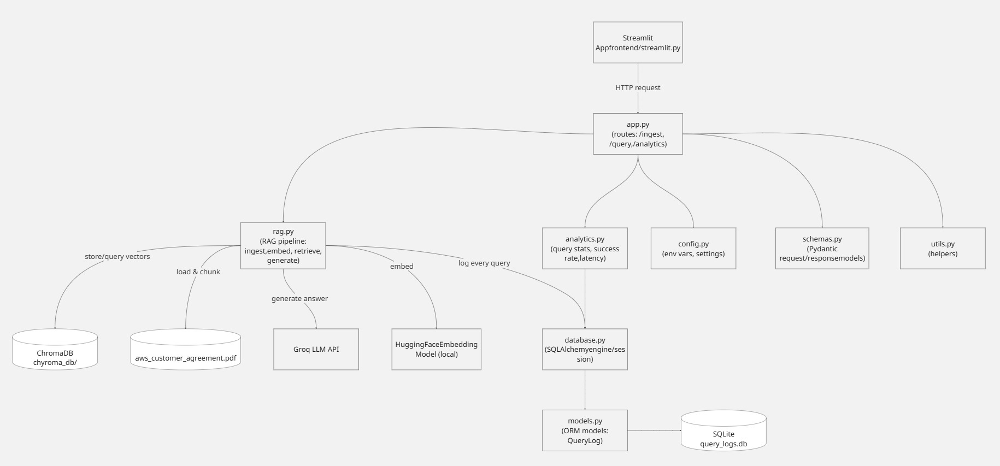
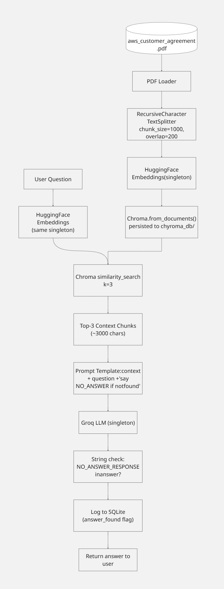

# RAG Document Q&A System with Analytics Dashboard
 
A **Retrieval-Augmented Generation (RAG)** system that answers natural-language questions about the AWS Customer Agreement PDF. Every query is logged to SQLite and an analytics dashboard surfaces operational insights — most asked questions, success rate, and average response latency.
 
Built with FastAPI, LangChain, ChromaDB, HuggingFace Embeddings, Groq LLM, and Streamlit.
 
---

## Video Demo
https://www.loom.com/share/35be996ae11d40398f4e9ea38a2072bf

---

## Folder Structure
```
vestaff-assignment/
├── backend/                       
│   ├── app.py
│   ├── config.py 
│   ├── database.py
│   ├── models.py
│   ├── schemas.py
│   ├── rag.py
│   ├── analytics.py   
│   └── utils.py
├── frontend/
│   └── streamlit.py
├── data/
│   └── aws_customer_agreement.pdf
├── chyroma_db/
├── query_logs.db
├── requirements.txt
├── .env.example
└── README.md
```
---

## Architecture overview



[Diagrams Link](https://drive.google.com/file/d/1cRMqlF0qmNd_tH0pu0VmcBOt0iETwg4p/view?usp=sharing)


---

## Setup Instructions

### 1. Clone the Repository

```bash
git clone <https://github.com/yadavabhishekz/vestaff-assignment>
cd assignement
```

### 2. Create a Virtual Environment

```bash
python -m venv venv

# Windows
venv\Scripts\activate

# macOS / Linux
source venv/bin/activate
```

### 3. Install Dependencies

```bash
pip install -r requirements.txt
```

### 4. Configure Environment Variables

```bash
cp .env.example .env
```

Edit `.env` and add your Groq API key:

```
GROQ_API_KEY=gsk_your_actual_key_here
```

### 5. Add the PDF

Place the **AWS Customer Agreement** PDF in the `data/` directory:

```
data/aws_customer_agreement.pdf
```

---

## How to Run

### Start the Backend (FastAPI)

From the **project root**:

```bash
uvicorn backend.app:app --reload --host 0.0.0.0 --port 8000
```

The API will be available at: `http://localhost:8000`

Interactive docs: `http://localhost:8000/docs`

### Start the Frontend (Streamlit)

In a **separate terminal**, from the **project root**:

```bash
streamlit run frontend/streamlit.py
```


### First-Time Usage

1. Start both the backend and frontend.
2. In the Streamlit sidebar, click **Ingest PDF**.
3. Wait for the success message.
4. Start asking questions in the Chat tab.

---

## Key Design Decisions

### Chunking Strategy

I went with chunk_size=1000 characters and chunk_overlap=200.

This is a legal document so the clauses are long. If I used something small like 200-300 characters I'd be cutting sentences in half and the chunk wouldn't make any sense when retrieved. 1000 characters is around 150 words which is enough to hold one complete legal thought.

The overlap of 200 is just so I don't lose context at the boundary between two chunks. If a clause starts near the end of chunk 1 and finishes in chunk 2, without overlap neither chunk has the full thing. 200 characters repeated across both solves that.

Also the splitter I used (RecursiveCharacterTextSplitter) doesn't just cut at exactly 1000 characters. It tries paragraph breaks first, then sentences, then words. Raw character cutting is the last resort. So chunks almost always end at natural points.


### Top-k Retrieval

I set k=3 — so 3 chunks get retrieved per question.

k=1 is not enough because one chunk can miss relevant parts that are spread across different sections of the document.

k=5 is too many. That's 5000 characters of context going into the prompt which makes the LLM slow, costs more tokens, and actually makes answers worse because the model loses focus in long contexts.

3 chunks gives roughly 3000 characters of context which is focused enough to be useful without being overwhelming for a 12-page document.

And by try and error k=3 was best fit giving relevant chunks need to answer the question.


### Anti-Hallucination

The prompt tells the LLM that if it can't find the answer in the context it must respond with exactly:

"The requested information is not present in the AWS Customer Agreement."

Then after the response comes back the code just checks:

pythonanswer_found = NO_ANSWER_RESPONSE.lower() not in answer.lower()

If that phrase is in the answer, answer_found = False gets stored in SQLite and shows up in the analytics dashboard under no-answer queries.

I didn't use similarity score thresholds because ChromaDB always returns k results regardless. Even for a totally out-of-scope question like "what's the weather", it still returns 3 chunks — they're just the "least wrong" ones. There's no meaningful cutoff score to detect that. Letting the LLM decide is simpler and actually works.


### Singleton Pattern

The embedding model, vector store, and LLM client are all expensive to create. Loading the HuggingFace model alone takes 3-4 seconds. If I created them fresh on every request the app would be unusably slow.

So all three are stored as module-level variables starting as None:

python_embeddings: HuggingFaceEmbeddings | None = None
_vectorstore: Chroma | None = None
_llm: ChatGroq | None = None

Each has a getter that creates the object on first call and caches it. After that every call just returns the same object. Load once, reuse forever.

---

## Documentaion used

### For SQLAlchemy 

for ORM : https://docs.sqlalchemy.org/en/20/orm/quickstart.html

for Query in SQLAlchemy : https://docs.sqlalchemy.org/en/14/orm/query.html#sqlalchemy.orm.Query.count

for frontend ui : https://docs.streamlit.io/